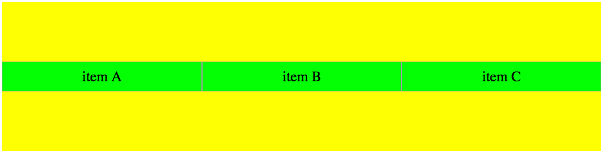

## Flex boxのスタイル定義

正解：3

paddingは要素の内側のスペースを設定するためのプロパティのため、`justify-content` を指定した際の振る舞いには無関係。 
1について、 `flex-shrink` の指定が有効になるためには `flex-basis` の値が固定値である必要がある。 `auto` が指定されていると親要素のサイズに合わせて横幅が変化するため、指定が効かない(下図参照)。 

