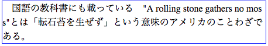

## 禁則処理

固定幅を持つ領域に対して文章を表示させる目的で、以下のようなHTMLを作成した。

```html
<p class="sample-text">
 　国語の教科書にも載っている　"A rolling stone gathers no moss"とは「転石苔を生ぜず」という意味のアメリカのことわざである。
</p>
```

この表示を確認したところ、以下のように英文が単語の途中で改行されてしまっていた。



この現象を引き起こす原因となったスタイル指定を次の中から選びなさい。  

1.
```
white-space: nowrap;
```

2.
```
white-space: pre;
```

3.
```
word-break: keep-all;
```

4.
```
word-break: break-all;
```
