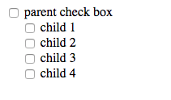

## ネストしたチェックボックス

以下のように、ネストしたチェックボックス及びそのDOM構造がある。



```html
<div class="wrapper">
  <input type="checkbox" class="parent-box"></input>
  <label for="parent-box">parent check box</label>
  <ul class="children-box-wrapper">
    <li>
      <input type="checkbox" class="child-box1"></input>
      <label for="child-box1">child 1</label>
    </li>
    <li>
      <input type="checkbox" class="child-box2"/>
      <label for="child-box2">child 2</label>
    </li>
    <li>
      <input type="checkbox" class="child-box3"></input>
      <label for="child-box3">child 3</label>
    </li>
    <li>
      <input type="checkbox" class="child-box4"/>
      <label for="child-box4">child 4</label>
    </li>
  </ul>
</div>
```

このとき、以下の仕様を満たすようにJavaScriptで制御を行いなさい。  
なお、上記画像中で`parent check box`のラベルがついているものを親、`child 1~4`の各ラベルがついているものを子と呼ぶことにする。  
また、回答作成および動作確認は[Codepen](https://codepen.io/narihiro/pen/OZNRYp)にて行うこと。

- 親をONにすると全ての子はONになる
- 親をOFFにすると全ての子はOFFになる
- 一つでも子がONになっている場合は親はONになる
- 全ての子がOFFになっているときのみ親はOFFになる
