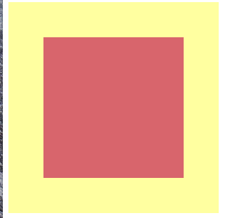

## DOMの入れ替え
正解：2

初期状態が以下のようであったとする。 

1の処理では `primal_child` 指定の要素に `alternative_child` 指定の要素を代入しようとしているが、これは取得した要素に対しての操作に過ぎず、画面上のDOMに何も変更を加えていないため見た目は変化しない。 
そこで、2のように子要素を `removeChild` を用いて削除し、新たなDOMを挿入する必要がある。
これにより、要素は以下のような外観になる。 

